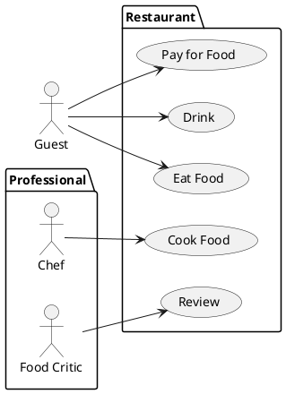
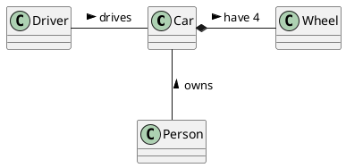

# Student information system - Enrollments

The module Enrollments enables to manage enrollments of students in courses in semesters and enrollments in specific schedule tickets in a given semester according to the planned schedule

## Functional Requirements

- A student needs to be able to enroll to a certain course, to have his studies registered.
- A student needs to be able to choose a certain schedule ticket of a course while enrolling, to be able to choose a time and teacher that suits him.
- A student needs to be able to enter himself to a waiting list of a schedule ticket, if said ticket is already full, so that he doesn't have to check all the time, whether a space has freed up.
- A student needs to be able to see all the prerequisities of a subject, so that he can plan his studies accordingly.
- A student needs to be able to see, whether he has already completed a certain subject, so that he can know, what subjects he has left.
- A student needs to see, whether a subject can be enrolled to repeatedly, so that he can plan his studies accordingly. 

### User requirements

[*List of user requirements*]

### System requirements

[*Document here your system requirements as use case diagrams.*]

#### Actors

[*Document here all actors from the use case diagrams. Make a subsection for each actor and their short description in each subsection.*]

##### [*Actor name*]

[*Actor description*]

#### Use cases

[*Document here all use cases. Create a subsection for each use case diagram. If you have only one use case diagram, you do not need a special subsection*]

##### [*Use case diagram title*]

[*Use case diagram in PlantUML*]

To be able to embed PlantUML diagrams to Markdown code with previews in VSCode you need
* Markdown All in One extension
* PlantUML extension
* Mardown Plantuml Preview extension

Follow https://plantuml.com/

[*Describe the diagram in a short paragraph. Describe each use case from the diagram in the detail from the lecture in a separate subsection.*]

###### [*Use case title*]

[*Use case description in the structure from the lecture.*]

[*Add an activity diagram for one use case per a team member*]

## Information model

[*Express the information model of the domain as a UML class diagram in PlantUML. Do not use class methods in the diagram, only classes, class attributes and associations connecting classes.*]

[*Document each class with a short description in a separate subsection*]

### [*Class name*]

[*Class description*]