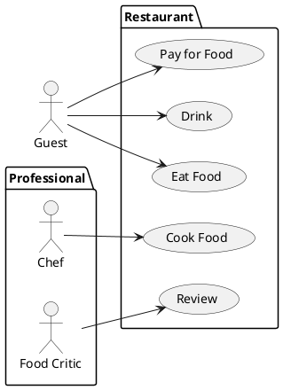
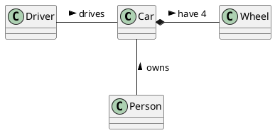

# Student information system - Module Enrollments

[*Module description*]

## Functional Requirements

Course Enrollment Management: The module should enable students to enroll in courses for a given semester and schedule. It should also ensure that a student cannot enroll in a course unless they have completed its prerequisites successfully. Additionally, it should allow a student to enroll in a course with a filled capacity by adding them to the waiting list.

Repeated Enrollments: The module should allow students to enroll in a course they have previously completed if the course is explicitly specified as allowing repeated enrollments.

Student List Management: The module should allow course guarantors and teachers to view the list of students enrolled in a particular course for a given semester and schedule. They should also be able to reallocate students between schedule sheets defined in the schedule for the given semester.

Email Communication: The module should allow course guarantors and teachers to send email messages to students enrolled in a particular course for a given semester and schedule.

Statistical Reports: The module should enable the creation of statistical reports on the number of students enrolled in subjects and timetables in individual semesters. Additionally, it should provide data on the teaching shares of teachers.

### User requirements

#### Students: ####
* View available courses and their prerequisite courses.
* Restrict course enrollment based on the requirements.
* Enroll in courses for a given semester and schedule.
* View their enrollment status.
* See waiting list of a course with filled capacity.
* Receive email notifications from course guarantors and teachers regarding the courses they are enrolled in.

#### Course Guarantors and Teachers: ####
* View list of students enrolled in their courses for a given semester and schedule.
* Send email messages to students enrolled in their course.
* Reallocate students between schedule sheets defined in the schedule for the given semester.

#### System: ####
* Create statistical reports on the number of students enrolled in subjects and timetables in individual semesters and on the teaching shares of teachers.

### System requirements

[*Document here your system requirements as use case diagrams.*]

#### Actors

[*Document here all actors from the use case diagrams. Make a subsection for each actor and their short description in each subsection.*]

##### [*Actor name*]

[*Actor description*]

#### Use cases

[*Document here all use cases. Create a subsection for each use case diagram. If you have only one use case diagram, you do not need a special subsection*]

##### [*Use case diagram title*]

[*Use case diagram in PlantUML*]

To be able to embed PlantUML diagrams to Markdown code with previews in VSCode you need
* Markdown All in One extension
* PlantUML extension
* Mardown Plantuml Preview extension

Follow https://plantuml.com/

[*Describe the diagram in a short paragraph. Describe each use case from the diagram in the detail from the lecture in a separate subsection.*]

###### [*Use case title*]

[*Use case description in the structure from the lecture.*]

[*Add an activity diagram for one use case per a team member*]

## Information model

[*Express the information model of the domain as a UML class diagram in PlantUML. Do not use class methods in the diagram, only classes, class attributes and associations connecting classes.*]

[*Document each class with a short description in a separate subsection*]

### [*Class name*]

[*Class description*]