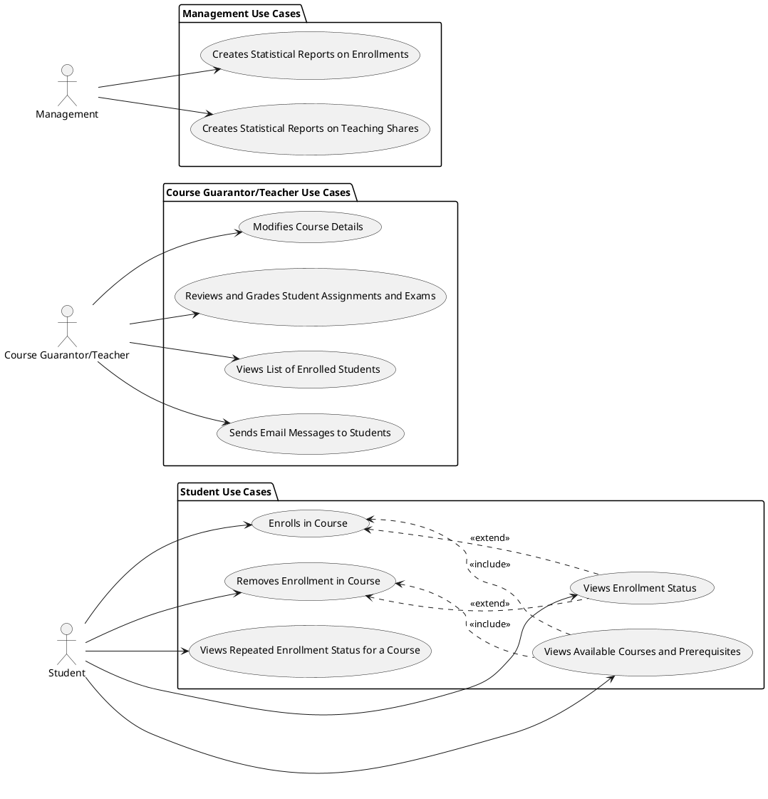
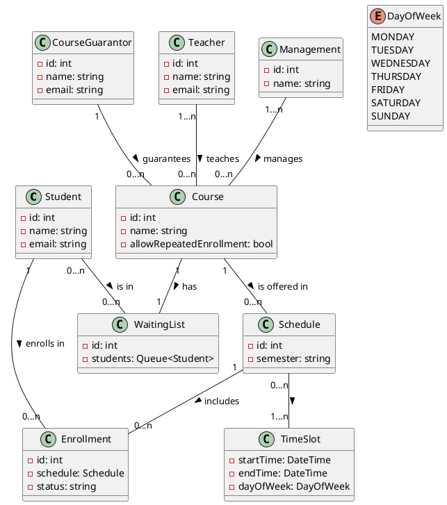

# Student information system - Module Enrollments

The module Enrollments enables to manage enrollments of students in courses in semesters and enrollments in specific schedule tickets in a given semester according to the planned schedule

## Functional Requirements

Course Enrollment Management: The module should enable students to enroll in courses for a given semester and schedule. It should also ensure that a student cannot enroll in a course unless they have completed its prerequisites successfully. Additionally, it should allow a student to enroll in a course with a filled capacity by adding them to the waiting list.

Repeated Enrollments: The module should allow students to enroll in a course they have previously completed if the course is explicitly specified as allowing repeated enrollments.

Student List Management: The module should allow course guarantors and teachers to view the list of students enrolled in a particular course for a given semester and schedule. They should also be able to reallocate students between schedule sheets defined in the schedule for the given semester.

Email Communication: The module should allow course guarantors and teachers to send email messages to students enrolled in a particular course for a given semester and schedule.

Statistical Reports: The module should enable the creation of statistical reports on the number of students enrolled in subjects and timetables in individual semesters. Additionally, it should provide data on the teaching shares of teachers.

### User requirements

#### Students: ####
* View available courses and their prerequisite courses.
  - So that he can plan his studies accordingly.
* Restrict course enrollment based on the requirements.
  - Ensures students have necessary knowledge.
* Enroll in courses for a given semester and schedule, or discard the enrollment.
  - Allows students to plan study schedules.
* View their enrollment status.
  - Helps students track course enrollments.
* Can add/remove themselves to/from a waiting list for a scheduled ticket that is already full.
  - So that he doesn't have to check whether a space has freed up.
* Receive email notifications from course guarantors and teachers regarding the courses they are enrolled in.
  - It is important for students to stay informed about changes that may affect their enrollment status or course schedules.
* See whether a subject can be enrolled to repeatedly.
  - So they can plan their studies accordingly.
* See whether they have already completed a certain subject.
  - So that they can know, what subjects they have left.
* Filter the view of available courses according factors like name, students requirement, faculty.
  - Students will be able to find their wanted course easier and in shorter time.
* See the schedule of courses of current semester during the enrollment.
  - Students can easily decide which schedule ticket is the best for them.
* Can verify their current schedule if it has time conflicts.
  - Students can prevent unpleasant ascertainment early.

#### Course Guarantors and Teachers: ####
* View list of students enrolled in their courses for a given semester and schedule.
  - For better communication with students
* Send email messages to students enrolled in their course.
  - This is important for teachers to communicate with their students and provide them with timely feedback and support.
* Reallocate students between schedule sheets defined in the schedule for the given semester.
  - Helps teachers adjust the course schedule and ensure that all students have an equal opportunity to participate in the course.
* Modify course details, such as prerequisites and allowed repeated enrollments.
  - To adjust course requirements to meet evolving teaching materials and student needs
* Review and grade student assignments and exams.
  - It is important for providing students with feedback on their work.

#### Management: ####
* Create statistical reports on the number of students enrolled in subjects and timetables in individual semesters and on the teaching shares of teachers.

### System requirements

#### Actors

##### Student
A person who enrolls in courses for a given semester and schedule.

##### Course Guarantor/Teacher
A person who manages the courses, the enrollments, and the communication with the students.

##### Management
A person who creates statistical reports.

#### Use cases

Student Enrolls in Course
1. Student selects a course from the available courses list.
2. The system displays the prerequisites required for the selected course.
3. If the student has completed the prerequisites, they can enroll in the course.
4. If the course has a filled capacity, the student can choose to add themselves to the waiting list.
5. The system updates the enrollment status of the student.

Student Removes Enrollment in Course
1. Student selects a course from their enrolled courses list.
2. The system displays the details of the selected course.
3. The student can choose to remove their enrollment in the course.
4. The system updates the enrollment status of the student.

Student Views Available Courses and Prerequisites
1. Student accesses the list of available courses.
2. The system displays the available courses along with their prerequisites.

Student Views Enrollment Status
1. Student accesses their enrollment status.
2. The system displays the courses the student is currently enrolled in.

Student Views Repeated Enrollment Status for a Course
1. Student accesses the list of available courses.
2. The system displays whether the student is allowed to enroll in a course they have previously completed.

Course Guarantor/Teacher Views List of Enrolled Students
1. Course guarantor/teacher selects a course for a given semester and schedule.
2. The system displays the list of students enrolled in the selected course.

Course Guarantor/Teacher Sends Email Messages to Students
1. Course guarantor/teacher selects a course for a given semester and schedule.
2. The system displays the list of students enrolled in the selected course.
3. The course guarantor/teacher writes an email message and sends it to the selected students.

Course Guarantor/Teacher Modifies Course Details
1. Course guarantor/teacher selects a course for a given semester and schedule.
2. The system displays the details of the selected course.
3. The course guarantor/teacher modifies the course details, such as prerequisites and allowed repeated enrollments.
4. The system updates the course details.

Course Guarantor/Teacher Reviews and Grades Student Assignments and Exams
1. Course guarantor/teacher selects a course for a given semester and schedule.
2. The system displays the list of students enrolled in the selected course.
3. The course guarantor/teacher selects a student and their assignment or exam to review.
4. The system displays the selected student's work.
5. The course guarantor/teacher provides a grade and feedback for the student's work.
6. The system updates the grade for the selected student's work.

Management Creates Statistical Reports on Enrollments
1. Management selects a semester to generate a statistical report.
2. The system generates a statistical report on the number of students enrolled in subjects and timetables for the selected semester.

##### Use case diagram

[*Describe the diagram in a short paragraph. Describe each use case from the diagram in the detail from the lecture in a separate subsection.*]

###### [*Use case title*]

[*Use case description in the structure from the lecture.*]

[*Add an activity diagram for one use case per a team member*]

## Information model

[*Express the information model of the domain as a UML class diagram in PlantUML. Do not use class methods in the diagram, only classes, class attributes and associations connecting classes.*]

[*Document each class with a short description in a separate subsection*]

### [*Class name*]

[*Class description*]